# ProxiAI Sequence Diagrams

**Document ID:** SD-001  
**Project:** ProxiAI — Enterprise AI Gateway & Audit Platform  
**Version:** 1.0  
**Status:** Approved for MVP Baseline  
**Audience:** Solo Developer, Reviewer, QA, Security Reviewer  
**Last Updated:** July 2026  

---

# 1. Purpose

This document describes the main ProxiAI runtime flows using sequence diagrams.

The diagrams are designed to help a beginner solo developer understand:

- which component starts each flow;
- which checks happen before provider access;
- which actions are synchronous;
- which actions happen asynchronously;
- where tenant isolation is enforced;
- how errors and fallback are handled;
- how data is stored safely;
- how background jobs update billing, analytics, and alerts.

This document does not add any new product feature. It visualizes the already approved MVP behavior.

---

# 2. Diagram Conventions

## 2.1 Main Participants

| Participant | Responsibility |
|---|---|
| User | Employee, team lead, or administrator |
| Browser | React frontend |
| API | Express backend |
| Auth Middleware | JWT validation and user context |
| Tenant Resolver | Organisation and scope validation |
| Validation | Zod request validation |
| Redis | Idempotency, cache, health, and BullMQ |
| PII Engine | Detection, classification, and risk scoring |
| Policy Engine | ALLOW, MASK, or BLOCK |
| Routing Engine | Provider filtering and scoring |
| Circuit Breaker | Provider health protection |
| Provider Adapter | Normalized LLM provider integration |
| MongoDB | Persistent application data |
| BullMQ | Durable background jobs |
| Worker | Billing, analytics, anomaly, health, or email worker |
| Audit Service | Append-only security and admin events |

---

## 2.2 Mermaid Notes

The diagrams use Mermaid syntax.

They can be previewed in:

- GitHub;
- GitLab;
- compatible VS Code Mermaid extensions;
- Mermaid Live Editor;
- documentation tools that support Mermaid.

Example:

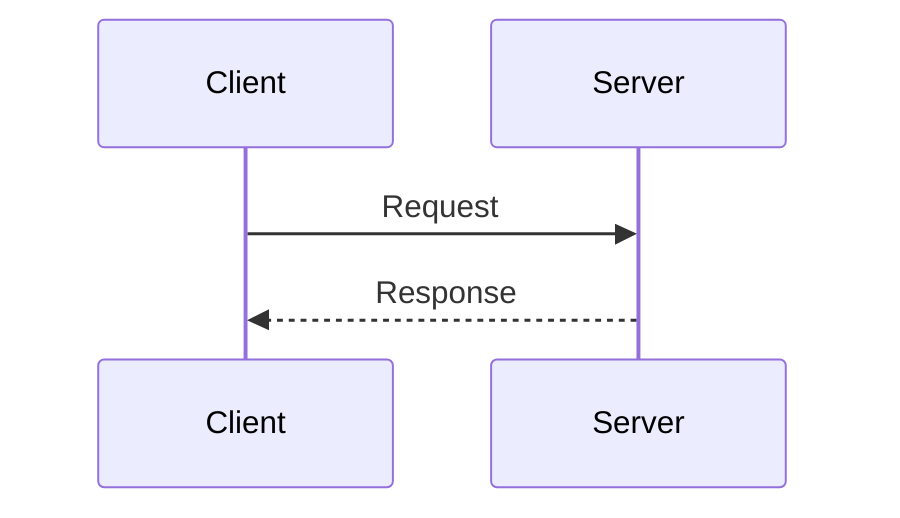
```mermaid
sequenceDiagram
    participant A as Client
    participant B as Server
    A->>B: Request
    B-->>A: Response
```

---

## 2.3 Required Security Order

Every chat request must preserve this order:

```text
Authentication
→ tenant and permission resolution
→ request validation
→ idempotency
→ rate limit
→ PII detection
→ risk scoring
→ policy decision
→ cache
→ routing
→ provider call
→ persistence
→ async jobs
```

The routing engine must never receive a blocked prompt.

---

# 3. Sequence Diagram Index

| Diagram | Flow |
|---|---|
| SD-01 | User login |
| SD-02 | Access-token refresh |
| SD-03 | Refresh-token reuse detection |
| SD-04 | Normal chat request |
| SD-05 | Prompt masked before provider call |
| SD-06 | Prompt blocked |
| SD-07 | Prompt cache hit |
| SD-08 | Automatic provider routing |
| SD-09 | Provider retry and fallback |
| SD-10 | Circuit breaker state transition |
| SD-11 | SSE streaming |
| SD-12 | Mid-stream failure |
| SD-13 | Duplicate request and idempotency |
| SD-14 | Metadata-only retention |
| SD-15 | Encrypted-storage retention |
| SD-16 | Request-completed background jobs |
| SD-17 | Billing worker |
| SD-18 | Anomaly worker |
| SD-19 | Provider health-check worker |
| SD-20 | Admin dashboard |
| SD-21 | Cursor pagination |
| SD-22 | Policy update |
| SD-23 | Retention update |
| SD-24 | User deactivation |
| SD-25 | Audit export |
| SD-26 | Readiness health check |
| SD-27 | Organisation boundary enforcement |
| SD-28 | Team-lead scope enforcement |
| SD-29 | Budget threshold warning |
| SD-30 | Budget exhausted block |
| SD-31 | Redis cache failure |
| SD-32 | Redis idempotency failure |
| SD-33 | MongoDB persistence failure |
| SD-34 | Queue worker retry |
| SD-35 | User logout |

---

# 4. SD-01 — User Login

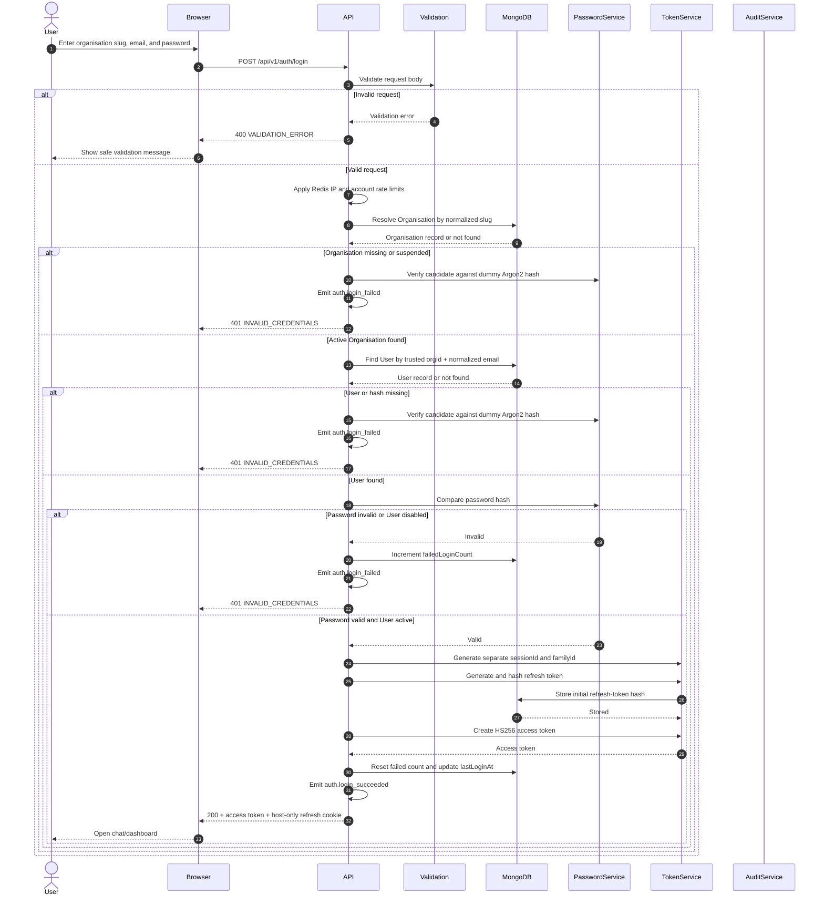
```mermaid
sequenceDiagram
    autonumber
    actor User
    participant Browser
    participant API
    participant Validation
    participant MongoDB
    participant PasswordService
    participant TokenService
    participant AuditService

    User->>Browser: Enter organisation slug, email, and password
    Browser->>API: POST /api/v1/auth/login
    API->>Validation: Validate request body

    alt Invalid request
        Validation-->>API: Validation error
        API-->>Browser: 400 VALIDATION_ERROR
        Browser-->>User: Show safe validation message
    else Valid request
        API->>API: Apply Redis IP and account rate limits
        API->>MongoDB: Resolve Organisation by normalized slug
        MongoDB-->>API: Organisation record or not found

        alt Organisation missing or suspended
            API->>PasswordService: Verify candidate against dummy Argon2 hash
            API->>API: Emit auth.login_failed
            API-->>Browser: 401 INVALID_CREDENTIALS
        else Active Organisation found
            API->>MongoDB: Find User by trusted orgId + normalized email
            MongoDB-->>API: User record or not found

            alt User or hash missing
                API->>PasswordService: Verify candidate against dummy Argon2 hash
                API->>API: Emit auth.login_failed
                API-->>Browser: 401 INVALID_CREDENTIALS
            else User found
                API->>PasswordService: Compare password hash

                alt Password invalid or User disabled
                    PasswordService-->>API: Invalid
                    API->>MongoDB: Increment failedLoginCount
                    API->>API: Emit auth.login_failed
                    API-->>Browser: 401 INVALID_CREDENTIALS
                else Password valid and User active
                    PasswordService-->>API: Valid
                    API->>TokenService: Generate separate sessionId and familyId
                    API->>TokenService: Generate and hash refresh token
                    TokenService->>MongoDB: Store initial refresh-token hash
                    MongoDB-->>TokenService: Stored
                    API->>TokenService: Create HS256 access token
                    TokenService-->>API: Access token
                    API->>MongoDB: Reset failed count and update lastLoginAt
                    API->>API: Emit auth.login_succeeded
                    API-->>Browser: 200 + access token + host-only refresh cookie
                    Browser-->>User: Open chat/dashboard
                end
            end
        end
    end
```

## Key Rules

- Login errors must not reveal whether an email exists.
- Passwords are never stored or logged in plaintext.
- Refresh tokens are stored as hashes.
- Successful, failed, and operational login outcomes emit structured security
  events. Durable audit persistence remains Phase 9.
- The refresh token is returned only as a secure HTTP-only cookie.

---

# 5. SD-02 — Access-Token Refresh

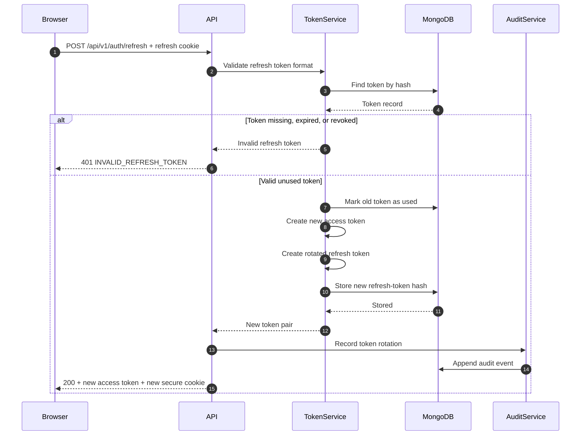
```mermaid
sequenceDiagram
    autonumber
    participant Browser
    participant API
    participant TokenService
    participant MongoDB
    participant AuditService

    Browser->>API: POST /api/v1/auth/refresh + refresh cookie
    API->>TokenService: Validate refresh token format
    TokenService->>MongoDB: Find token by hash
    MongoDB-->>TokenService: Token record

    alt Token missing, expired, or revoked
        TokenService-->>API: Invalid refresh token
        API-->>Browser: 401 INVALID_REFRESH_TOKEN
    else Valid unused token
        TokenService->>MongoDB: Mark old token as used
        TokenService->>TokenService: Create new access token
        TokenService->>TokenService: Create rotated refresh token
        TokenService->>MongoDB: Store new refresh-token hash
        MongoDB-->>TokenService: Stored
        TokenService-->>API: New token pair
        API->>AuditService: Record token rotation
        AuditService->>MongoDB: Append audit event
        API-->>Browser: 200 + new access token + new secure cookie
    end
```

## Key Rules

- Refresh tokens are one-time use.
- Rotation keeps the same token family.
- Old refresh tokens remain marked as used.
- The browser must replace the previous access token.

---

# 6. SD-03 — Refresh-Token Reuse Detection

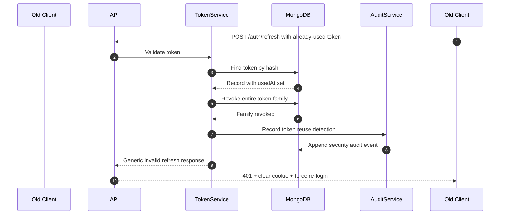
```mermaid
sequenceDiagram
    autonumber
    participant AttackerOrOldClient as Old Client
    participant API
    participant TokenService
    participant MongoDB
    participant AuditService

    Old Client->>API: POST /auth/refresh with already-used token
    API->>TokenService: Validate token
    TokenService->>MongoDB: Find token by hash
    MongoDB-->>TokenService: Record with usedAt set
    TokenService->>MongoDB: Revoke entire token family
    MongoDB-->>TokenService: Family revoked
    TokenService->>AuditService: Record token reuse detection
    AuditService->>MongoDB: Append security audit event
        TokenService-->>API: Generic invalid refresh response
        API-->>Old Client: 401 + clear cookie + force re-login
```

## Key Rules

- Reuse indicates possible token theft.
- The complete token family is revoked.
- The event is security-relevant and must be audited.
- No new token is issued.

---

# 7. SD-04 — Normal Chat Request

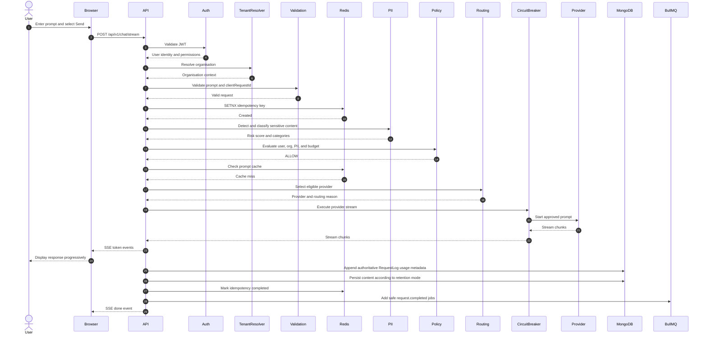
```mermaid
sequenceDiagram
    autonumber
    actor User
    participant Browser
    participant API
    participant Auth
    participant TenantResolver
    participant Validation
    participant Redis
    participant PII
    participant Policy
    participant Routing
    participant CircuitBreaker
    participant Provider
    participant MongoDB
    participant BullMQ

    User->>Browser: Enter prompt and select Send
    Browser->>API: POST /api/v1/chat/stream
    API->>Auth: Validate JWT
    Auth-->>API: User identity and permissions
    API->>TenantResolver: Resolve organisation
    TenantResolver-->>API: Organisation context
    API->>Validation: Validate prompt and clientRequestId
    Validation-->>API: Valid request
    API->>Redis: SETNX idempotency key
    Redis-->>API: Created
    API->>PII: Detect and classify sensitive content
    PII-->>API: Risk score and categories
    API->>Policy: Evaluate user, org, PII, and budget
    Policy-->>API: ALLOW
    API->>Redis: Check prompt cache
    Redis-->>API: Cache miss
    API->>Routing: Select eligible provider
    Routing-->>API: Provider and routing reason
    API->>CircuitBreaker: Execute provider stream
    CircuitBreaker->>Provider: Start approved prompt
    Provider-->>CircuitBreaker: Stream chunks
    CircuitBreaker-->>API: Stream chunks
    API-->>Browser: SSE token events
    Browser-->>User: Display response progressively
    API->>MongoDB: Append authoritative RequestLog usage metadata
    API->>MongoDB: Persist content according to retention mode
    API->>Redis: Mark idempotency completed
    API->>BullMQ: Add safe request.completed jobs
    API-->>Browser: SSE done event
```

## Key Rules

- Policy runs before routing.
- Only the approved prompt reaches the provider.
- Async jobs do not delay the final user response.
- Persistence follows organisation retention mode.
- Idempotency prevents a duplicate paid call.

---

# 8. SD-05 — Prompt Masked Before Provider Call

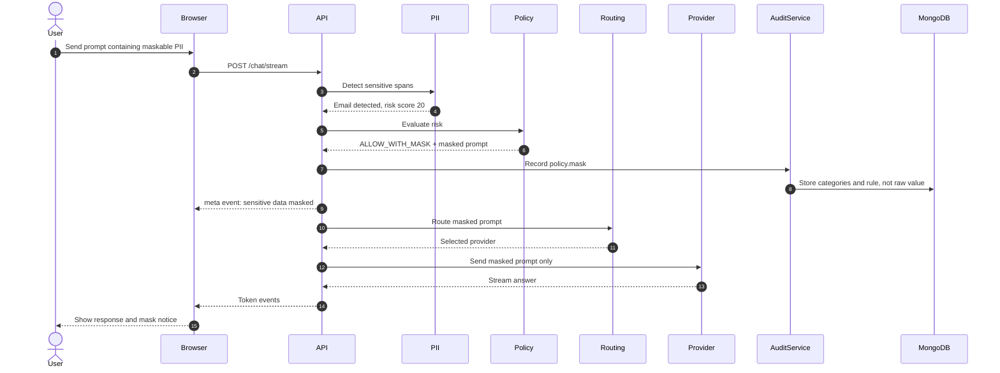
```mermaid
sequenceDiagram
    autonumber
    actor User
    participant Browser
    participant API
    participant PII
    participant Policy
    participant Routing
    participant Provider
    participant AuditService
    participant MongoDB

    User->>Browser: Send prompt containing maskable PII
    Browser->>API: POST /chat/stream
    API->>PII: Detect sensitive spans
    PII-->>API: Email detected, risk score 20
    API->>Policy: Evaluate risk
    Policy-->>API: ALLOW_WITH_MASK + masked prompt
    API->>AuditService: Record policy.mask
    AuditService->>MongoDB: Store categories and rule, not raw value
    API-->>Browser: meta event: sensitive data masked
    API->>Routing: Route masked prompt
    Routing-->>API: Selected provider
    API->>Provider: Send masked prompt only
    Provider-->>API: Stream answer
    API-->>Browser: Token events
    Browser-->>User: Show response and mask notice
```

## Key Rules

- The original prompt must not be passed to routing after masking.
- Audit metadata contains category and rule only.
- Provider receives the masked text.
- The user receives a clear notice.

---

# 9. SD-06 — Prompt Blocked

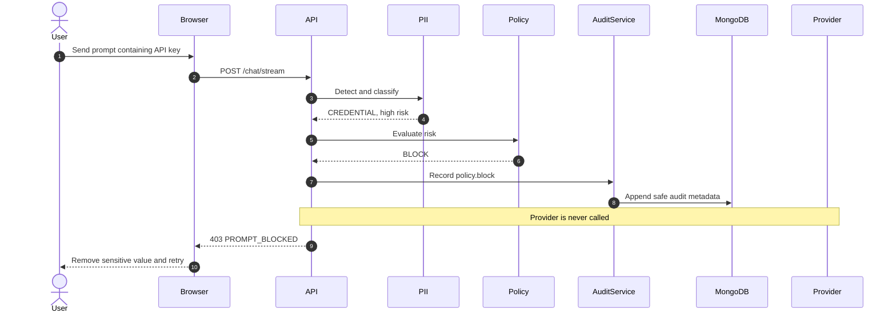
```mermaid
sequenceDiagram
    autonumber
    actor User
    participant Browser
    participant API
    participant PII
    participant Policy
    participant AuditService
    participant MongoDB
    participant Provider

    User->>Browser: Send prompt containing API key
    Browser->>API: POST /chat/stream
    API->>PII: Detect and classify
    PII-->>API: CREDENTIAL, high risk
    API->>Policy: Evaluate risk
    Policy-->>API: BLOCK
    API->>AuditService: Record policy.block
    AuditService->>MongoDB: Append safe audit metadata
    Note over API,Provider: Provider is never called
    API-->>Browser: 403 PROMPT_BLOCKED
    Browser-->>User: Remove sensitive value and retry
```

## Key Rules

- Provider call count must be exactly zero.
- The raw credential must not be logged.
- The block reason should be understandable but safe.
- Blocked requests may still create metadata-only audit records.

---

# 10. SD-07 — Prompt Cache Hit

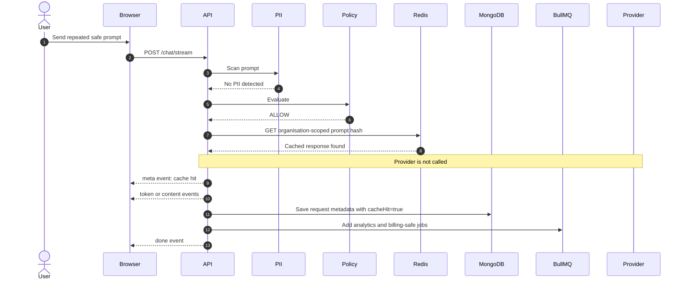
```mermaid
sequenceDiagram
    autonumber
    actor User
    participant Browser
    participant API
    participant PII
    participant Policy
    participant Redis
    participant MongoDB
    participant BullMQ
    participant Provider

    User->>Browser: Send repeated safe prompt
    Browser->>API: POST /chat/stream
    API->>PII: Scan prompt
    PII-->>API: No PII detected
    API->>Policy: Evaluate
    Policy-->>API: ALLOW
    API->>Redis: GET organisation-scoped prompt hash
    Redis-->>API: Cached response found
    Note over API,Provider: Provider is not called
    API-->>Browser: meta event: cache hit
    API-->>Browser: token or content events
    API->>MongoDB: Save request metadata with cacheHit=true
    API->>BullMQ: Add analytics and billing-safe jobs
    API-->>Browser: done event
```

## Key Rules

- Cache key includes `orgId`.
- PII prompts are not cacheable.
- Retention policy must permit caching.
- Cache hit metadata is recorded.

---

# 11. SD-08 — Automatic Provider Routing

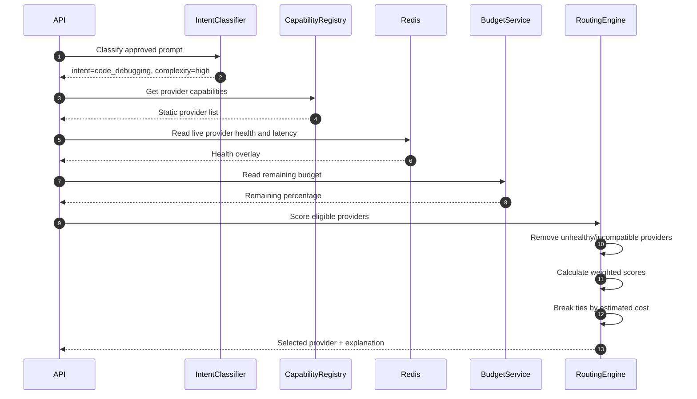
```mermaid
sequenceDiagram
    autonumber
    participant API
    participant IntentClassifier
    participant CapabilityRegistry
    participant Redis
    participant BudgetService
    participant RoutingEngine

    API->>IntentClassifier: Classify approved prompt
    IntentClassifier-->>API: intent=code_debugging, complexity=high
    API->>CapabilityRegistry: Get provider capabilities
    CapabilityRegistry-->>API: Static provider list
    API->>Redis: Read live provider health and latency
    Redis-->>API: Health overlay
    API->>BudgetService: Read remaining budget
    BudgetService-->>API: Remaining percentage
    API->>RoutingEngine: Score eligible providers
    RoutingEngine->>RoutingEngine: Remove unhealthy/incompatible providers
    RoutingEngine->>RoutingEngine: Calculate weighted scores
    RoutingEngine->>RoutingEngine: Break ties by estimated cost
    RoutingEngine-->>API: Selected provider + explanation
```

## Key Rules

- Context-window incompatibility removes a provider before scoring.
- Unhealthy providers are excluded.
- Low budget can remove expensive providers.
- Routing explanation is stored as metadata.

---

# 12. SD-09 — Provider Retry and Fallback

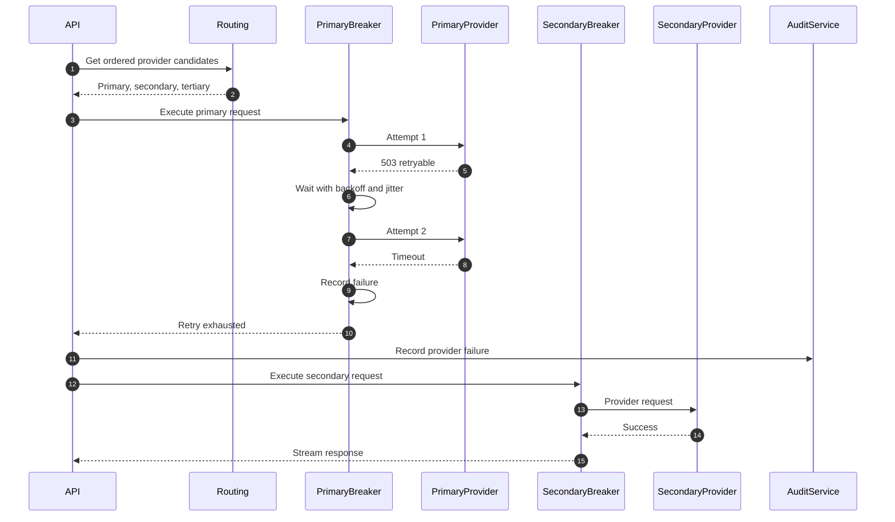
```mermaid
sequenceDiagram
    autonumber
    participant API
    participant Routing
    participant PrimaryBreaker
    participant PrimaryProvider
    participant SecondaryBreaker
    participant SecondaryProvider
    participant AuditService

    API->>Routing: Get ordered provider candidates
    Routing-->>API: Primary, secondary, tertiary
    API->>PrimaryBreaker: Execute primary request
    PrimaryBreaker->>PrimaryProvider: Attempt 1
    PrimaryProvider-->>PrimaryBreaker: 503 retryable
    PrimaryBreaker->>PrimaryBreaker: Wait with backoff and jitter
    PrimaryBreaker->>PrimaryProvider: Attempt 2
    PrimaryProvider-->>PrimaryBreaker: Timeout
    PrimaryBreaker->>PrimaryBreaker: Record failure
    PrimaryBreaker-->>API: Retry exhausted
    API->>AuditService: Record provider failure
    API->>SecondaryBreaker: Execute secondary request
    SecondaryBreaker->>SecondaryProvider: Provider request
    SecondaryProvider-->>SecondaryBreaker: Success
    SecondaryBreaker-->>API: Stream response
```

## Key Rules

- Retry applies only to approved retryable errors.
- Fallback occurs only before the first user-visible token.
- The fallback provider receives the same approved sanitized prompt.
- Provider failure is recorded without exposing secret configuration.

---

# 13. SD-10 — Circuit Breaker State Transition

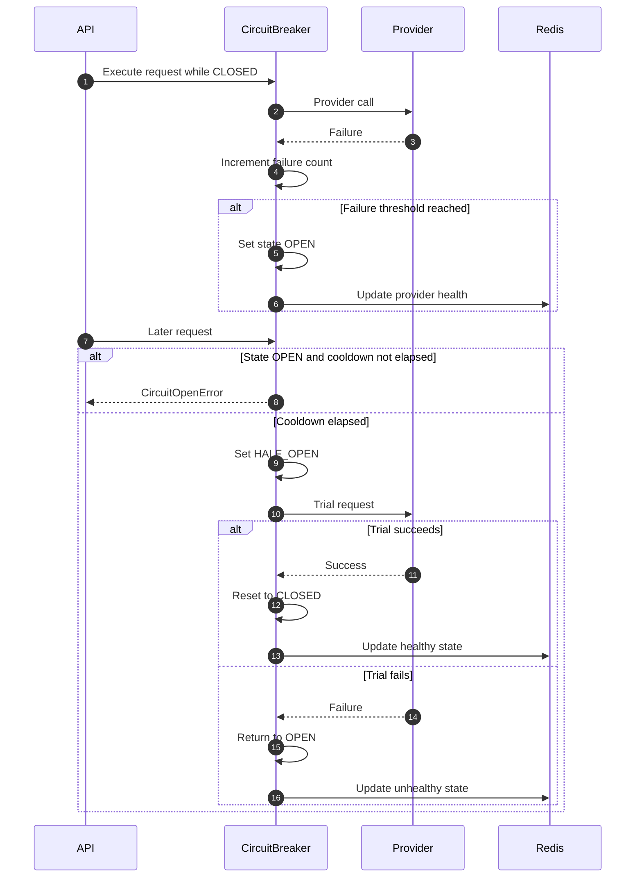
```mermaid
sequenceDiagram
    autonumber
    participant API
    participant CircuitBreaker
    participant Provider
    participant Redis

    API->>CircuitBreaker: Execute request while CLOSED
    CircuitBreaker->>Provider: Provider call
    Provider-->>CircuitBreaker: Failure
    CircuitBreaker->>CircuitBreaker: Increment failure count

    alt Failure threshold reached
        CircuitBreaker->>CircuitBreaker: Set state OPEN
        CircuitBreaker->>Redis: Update provider health
    end

    API->>CircuitBreaker: Later request
    alt State OPEN and cooldown not elapsed
        CircuitBreaker-->>API: CircuitOpenError
    else Cooldown elapsed
        CircuitBreaker->>CircuitBreaker: Set HALF_OPEN
        CircuitBreaker->>Provider: Trial request

        alt Trial succeeds
            Provider-->>CircuitBreaker: Success
            CircuitBreaker->>CircuitBreaker: Reset to CLOSED
            CircuitBreaker->>Redis: Update healthy state
        else Trial fails
            Provider-->>CircuitBreaker: Failure
            CircuitBreaker->>CircuitBreaker: Return to OPEN
            CircuitBreaker->>Redis: Update unhealthy state
        end
    end
```

## Key Rules

- Open circuits fail fast.
- Half-open permits a controlled trial.
- In-memory state is acceptable for a single-instance MVP.
- Redis-shared circuit state remains a roadmap improvement.

---

# 14. SD-11 — Authenticated SSE Streaming

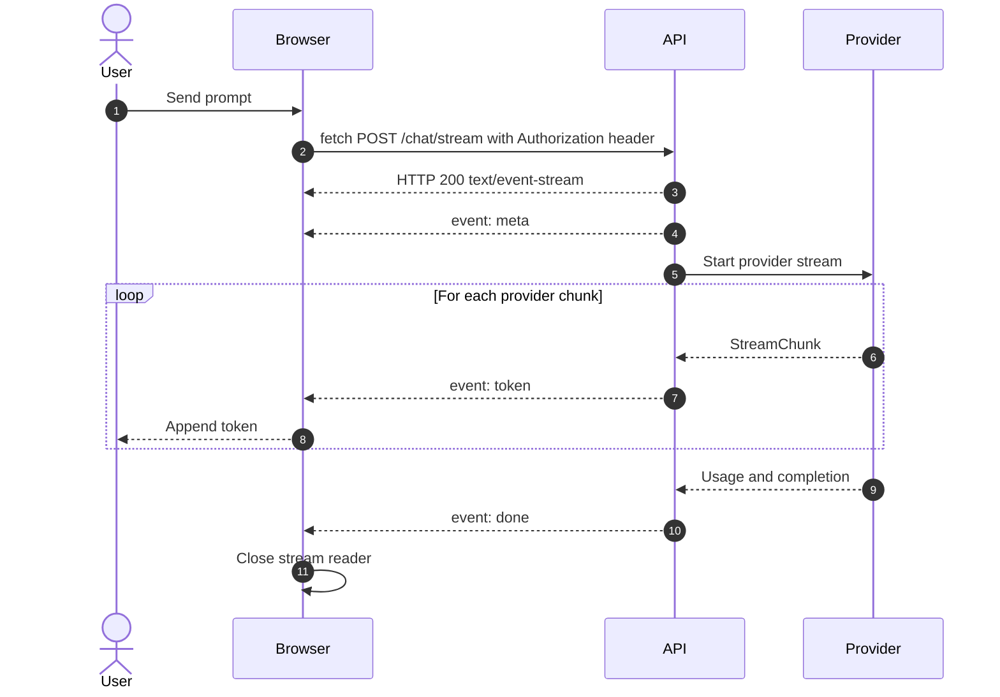
```mermaid
sequenceDiagram
    autonumber
    actor User
    participant Browser
    participant API
    participant Provider

    User->>Browser: Send prompt
    Browser->>API: fetch POST /chat/stream with Authorization header
    API-->>Browser: HTTP 200 text/event-stream
    API-->>Browser: event: meta
    API->>Provider: Start provider stream

    loop For each provider chunk
        Provider-->>API: StreamChunk
        API-->>Browser: event: token
        Browser-->>User: Append token
    end

    Provider-->>API: Usage and completion
    API-->>Browser: event: done
    Browser->>Browser: Close stream reader
```

## Key Rules

- The frontend uses `fetch`, not browser `EventSource`.
- Pre-stream errors use JSON.
- After headers are sent, failures use SSE events.
- The browser appends token text in order.

---

# 15. SD-12 — Mid-Stream Failure

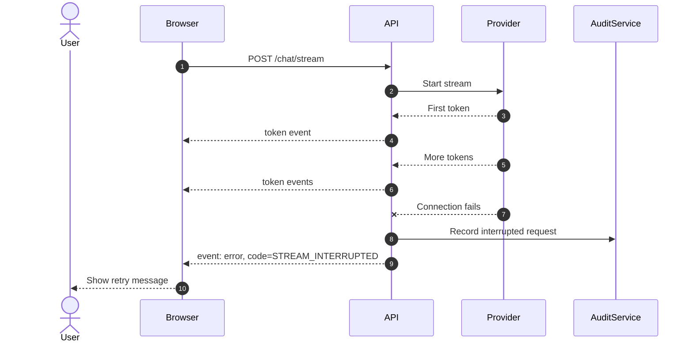
```mermaid
sequenceDiagram
    autonumber
    actor User
    participant Browser
    participant API
    participant Provider
    participant AuditService

    Browser->>API: POST /chat/stream
    API->>Provider: Start stream
    Provider-->>API: First token
    API-->>Browser: token event
    Provider-->>API: More tokens
    API-->>Browser: token events
    Provider--xAPI: Connection fails
    API->>AuditService: Record interrupted request
    API-->>Browser: event: error, code=STREAM_INTERRUPTED
    Browser-->>User: Show retry message
```

## Key Rules

- No silent provider swap after visible output begins.
- Partial output must be clearly marked incomplete.
- The user decides whether to retry.
- The failure should contribute to provider-health tracking.

---

# 16. SD-13 — Duplicate Request and Idempotency

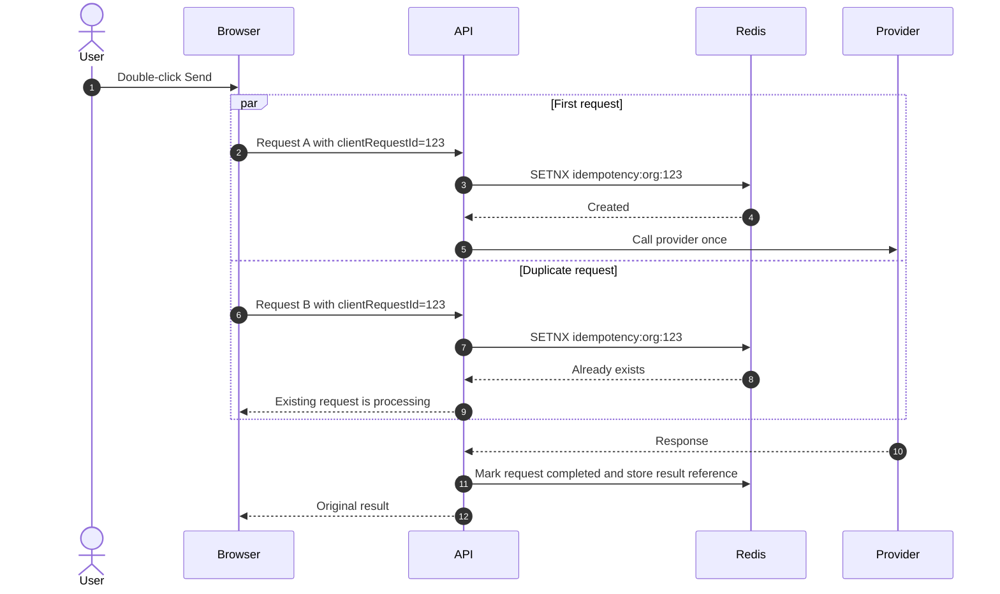
```mermaid
sequenceDiagram
    autonumber
    actor User
    participant Browser
    participant API
    participant Redis
    participant Provider

    User->>Browser: Double-click Send
    par First request
        Browser->>API: Request A with clientRequestId=123
        API->>Redis: SETNX idempotency:org:123
        Redis-->>API: Created
        API->>Provider: Call provider once
    and Duplicate request
        Browser->>API: Request B with clientRequestId=123
        API->>Redis: SETNX idempotency:org:123
        Redis-->>API: Already exists
        API-->>Browser: Existing request is processing
    end

    Provider-->>API: Response
    API->>Redis: Mark request completed and store result reference
    API-->>Browser: Original result
```

## Key Rules

- Idempotency key includes `orgId`.
- Duplicate requests must not create duplicate provider calls.
- Completed results may be returned using a safe result reference.
- The client request ID is generated once per user action.

---

# 17. SD-14 — Metadata-Only Retention

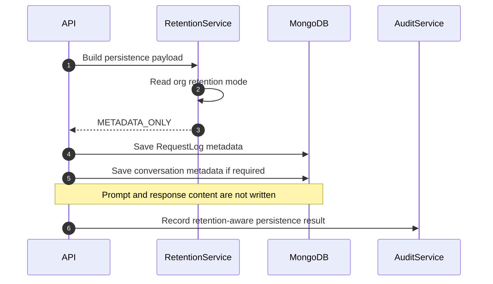
```mermaid
sequenceDiagram
    autonumber
    participant API
    participant RetentionService
    participant MongoDB
    participant AuditService

    API->>RetentionService: Build persistence payload
    RetentionService->>RetentionService: Read org retention mode
    RetentionService-->>API: METADATA_ONLY
    API->>MongoDB: Save RequestLog metadata
    API->>MongoDB: Save conversation metadata if required
    Note over API,MongoDB: Prompt and response content are not written
    API->>AuditService: Record retention-aware persistence result
```

## Key Rules

- The application must not construct plaintext content fields.
- Token, provider, latency, cost, and risk metadata may still be stored.
- Missing message content is expected behavior, not an error.

---

# 18. SD-15 — Encrypted-Storage Retention

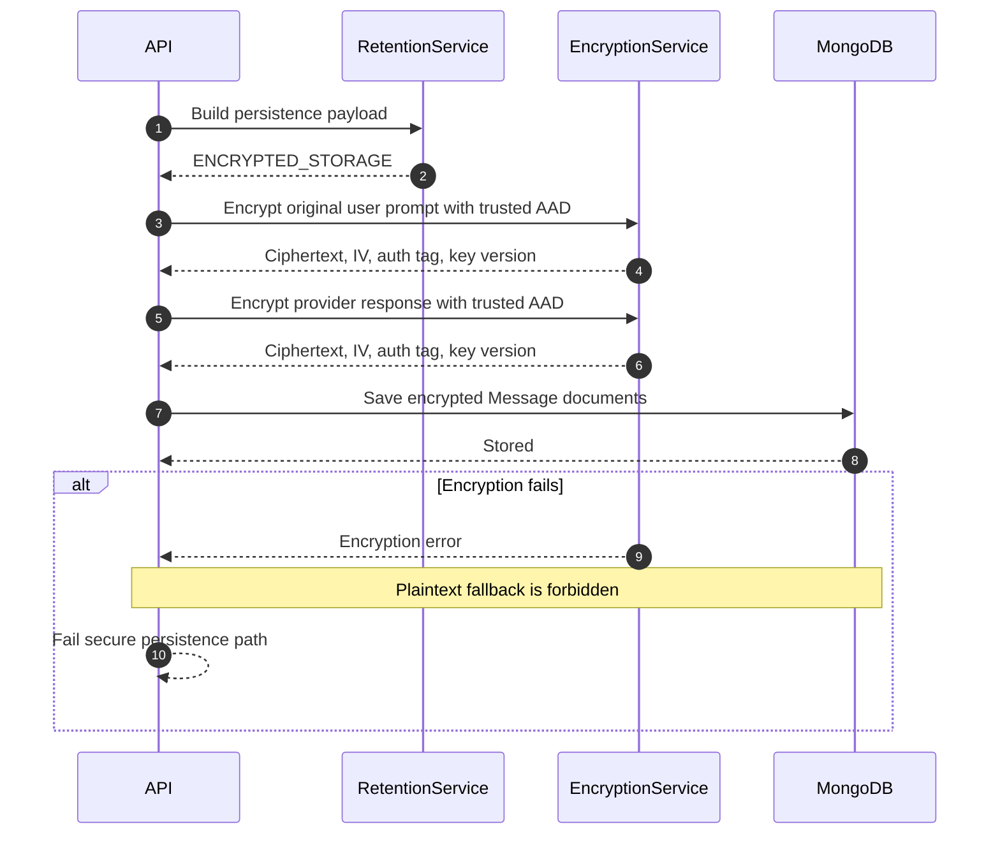
```mermaid
sequenceDiagram
    autonumber
    participant API
    participant RetentionService
    participant EncryptionService
    participant MongoDB

    API->>RetentionService: Build persistence payload
    RetentionService-->>API: ENCRYPTED_STORAGE
    API->>EncryptionService: Encrypt original user prompt with trusted AAD
    EncryptionService-->>API: Ciphertext, IV, auth tag, key version
    API->>EncryptionService: Encrypt provider response with trusted AAD
    EncryptionService-->>API: Ciphertext, IV, auth tag, key version
    API->>MongoDB: Save encrypted Message documents
    MongoDB-->>API: Stored

    alt Encryption fails
        EncryptionService-->>API: Encryption error
        Note over API,MongoDB: Plaintext fallback is forbidden
        API-->>API: Fail secure persistence path
    end
```

## Key Rules

- AES-256-GCM is used.
- Plaintext must never be stored as fallback.
- Key material is not stored in MongoDB.
- New writes use the validated active key version; old versions remain for reads.
- Successful user/assistant writes are idempotently linked by trusted requestId.
- Full-text search over ciphertext is unavailable.

---

# 19. SD-16 — Request-Completed Background Jobs

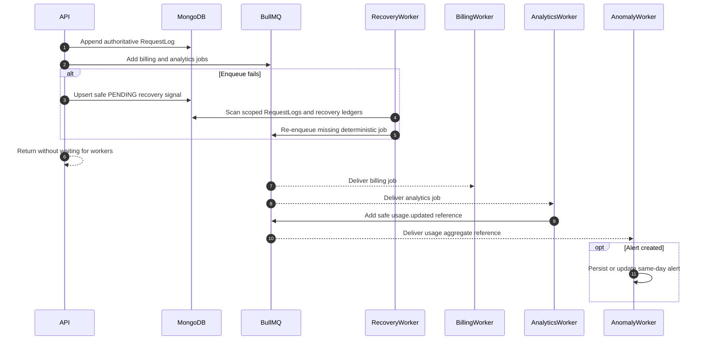
```mermaid
sequenceDiagram
    autonumber
    participant API
    participant MongoDB
    participant BullMQ
    participant RecoveryWorker
    participant BillingWorker
    participant AnalyticsWorker
    participant AnomalyWorker

    API->>MongoDB: Append authoritative RequestLog
    API->>BullMQ: Add billing and analytics jobs
    alt Enqueue fails
        API->>MongoDB: Upsert safe PENDING recovery signal
        RecoveryWorker->>MongoDB: Scan scoped RequestLogs and recovery ledgers
        RecoveryWorker->>BullMQ: Re-enqueue missing deterministic job
    end
    API-->>API: Return without waiting for workers

    BullMQ-->>BillingWorker: Deliver billing job
    BullMQ-->>AnalyticsWorker: Deliver analytics job
    AnalyticsWorker->>BullMQ: Add safe usage.updated reference
    BullMQ-->>AnomalyWorker: Deliver usage aggregate reference
    opt Alert created
        AnomalyWorker->>AnomalyWorker: Persist or update same-day alert
    end
```

## Key Rules

- The chat response must not wait for worker completion.
- Jobs use typed payloads.
- Raw prompts must not be included.
- Every worker must be idempotent.
- RequestLog remains append-only; recovery state lives in a separate ledger.
- Recovery attempts are bounded and tenant-scoped.

---

# 20. SD-17 — Billing Worker

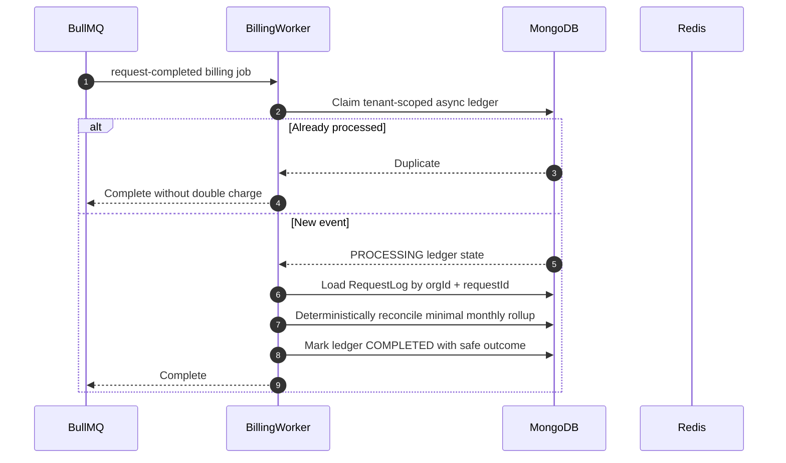
```mermaid
sequenceDiagram
    autonumber
    participant BullMQ
    participant BillingWorker
    participant MongoDB
    participant Redis

    BullMQ->>BillingWorker: request-completed billing job
    BillingWorker->>MongoDB: Claim tenant-scoped async ledger

    alt Already processed
        MongoDB-->>BillingWorker: Duplicate
        BillingWorker-->>BullMQ: Complete without double charge
    else New event
        MongoDB-->>BillingWorker: PROCESSING ledger state
        BillingWorker->>MongoDB: Load RequestLog by orgId + requestId
        BillingWorker->>MongoDB: Deterministically reconcile minimal monthly rollup
        BillingWorker->>MongoDB: Mark ledger COMPLETED with safe outcome
        BillingWorker-->>BullMQ: Complete
    end
```

## Key Rules

- At-least-once delivery must not create duplicate billing.
- RequestLog remains append-only; worker state lives in a separate ledger.
- Unknown usage remains unknown and does not become zero.
- Cost is optional and omitted until approved pricing exists.
- Monthly rollup is scoped by `orgId` and period.
- Billing does not require raw prompt content.

---

# 21. SD-18 — Anomaly Worker

```mermaid
sequenceDiagram
    autonumber
    participant BullMQ
    participant AnomalyWorker
    participant MongoDB

    BullMQ->>AnomalyWorker: Safe analytics usage.updated reference
    AnomalyWorker->>MongoDB: Read trusted org feature flag and scoped daily usage
    MongoDB-->>AnomalyWorker: Current known tokens and prior seven-day baseline
    AnomalyWorker->>AnomalyWorker: Exclude unknown days; require 3 active days; compare > 2x

    alt Usage is anomalous
        AnomalyWorker->>MongoDB: Create/update HIGH OPEN same-day alert
    else Usage is normal
        AnomalyWorker->>MongoDB: Reuse/update/resolve same-day alert when applicable
    end
```

## Key Rules

- Anomaly does not automatically prove misuse.
- Detection requires trusted `Organisation.featureFlags.anomalyDetection`.
- Alert records and aggregate queries are scoped by trusted `orgId` and
  `userId`.
- Duplicate jobs must not create duplicate
  `{ orgId, userId, observedDay, ANOMALY }` alerts.
- Unknown baseline usage is excluded, never converted to zero.
- P7-07 does not enqueue email or notification work.

---

# 22. SD-19 — Provider Health-Check Worker

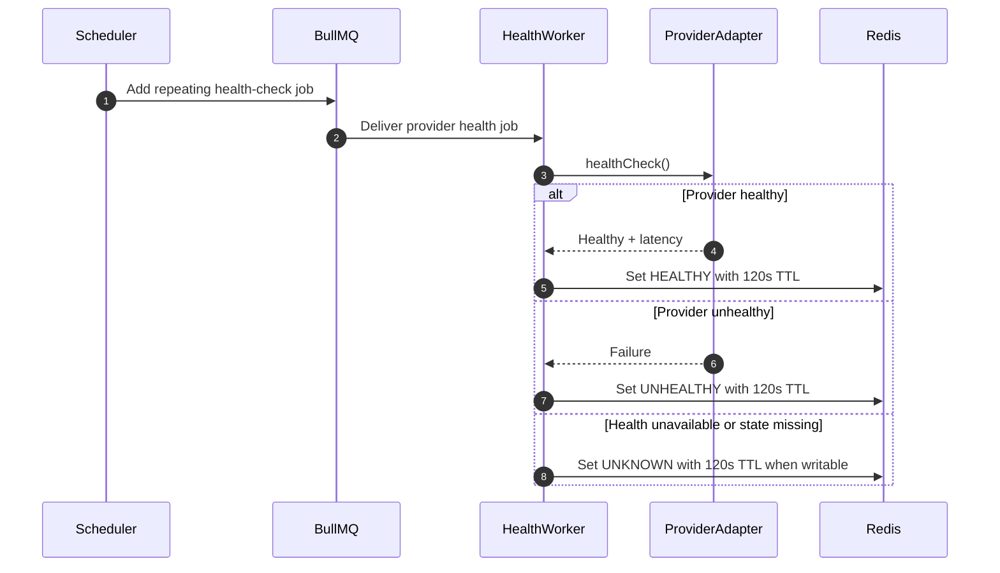
```mermaid
sequenceDiagram
    autonumber
    participant Scheduler
    participant BullMQ
    participant HealthWorker
    participant ProviderAdapter
    participant Redis

    Scheduler->>BullMQ: Add repeating health-check job
    BullMQ->>HealthWorker: Deliver provider health job
    HealthWorker->>ProviderAdapter: healthCheck()

    alt Provider healthy
        ProviderAdapter-->>HealthWorker: Healthy + latency
        HealthWorker->>Redis: Set HEALTHY with 120s TTL
    else Provider unhealthy
        ProviderAdapter-->>HealthWorker: Failure
        HealthWorker->>Redis: Set UNHEALTHY with 120s TTL
    else Health unavailable or state missing
        HealthWorker->>Redis: Set UNKNOWN with 120s TTL when writable
    end
```

## Key Rules

- Health checks must use minimal-cost requests.
- Provider secrets must not appear in logs.
- Only approved enabled-provider registry IDs are scheduled every 60 seconds.
- Routing skips only `UNHEALTHY`; `HEALTHY` and `UNKNOWN` preserve existing rules.
- Static capability and local circuit state remain the fallback if Redis is unavailable.
- Phase 7 stores no MongoDB provider-health history.

---

# 23. SD-20 — Admin Dashboard

```mermaid
sequenceDiagram
    autonumber
    actor Admin
    participant Browser
    participant API
    participant Auth
    participant RBAC
    participant MongoDB
    participant Redis

    Admin->>Browser: Open dashboard
    Browser->>API: GET /api/v1/admin/dashboard
    API->>Auth: Validate access token
    Auth-->>API: Admin identity
    API->>RBAC: Require ADMIN_VIEW_DASHBOARD
    RBAC-->>API: Allowed
    API->>MongoDB: Read org-scoped request and billing aggregates
    MongoDB-->>API: Usage, cost, alerts, fallback data
    API->>Redis: Read live provider health
    Redis-->>API: Health data
    API-->>Browser: Standard success envelope
    Browser-->>Admin: Display KPIs
```

## Key Rules

- `orgId` comes from authenticated context, not arbitrary query input.
- Admin dashboard defaults to metadata.
- High-cardinality raw data is not loaded unnecessarily.
- Provider health is TTL-bounded Redis current state; Phase 7 keeps no MongoDB
  provider-health history.

---

# 24. SD-21 — Cursor Pagination

```mermaid
sequenceDiagram
    autonumber
    actor Admin
    participant Browser
    participant API
    participant CursorService
    participant MongoDB

    Admin->>Browser: Select Load More
    Browser->>API: GET /admin/logs?cursor=opaque-value
    API->>CursorService: Decode and validate cursor

    alt Cursor invalid
        CursorService-->>API: Validation error
        API-->>Browser: 400 INVALID_CURSOR
    else Cursor valid
        CursorService-->>API: createdAt and _id
        API->>MongoDB: Query orgId + cursor conditions + limit+1
        MongoDB-->>API: Ordered records
        API->>CursorService: Encode next cursor
        CursorService-->>API: Opaque nextCursor
        API-->>Browser: Records + nextCursor
    end
```

## Key Rules

- Cursor includes `createdAt` and `_id`.
- Tenant filter is always applied.
- Client never constructs the cursor.
- Sort and index order must match.

---

# 25. SD-22 — Policy Update

```mermaid
sequenceDiagram
    autonumber
    actor Admin
    participant Browser
    participant API
    participant Auth
    participant RBAC
    participant Validation
    participant MongoDB
    participant AuditService

    Admin->>Browser: Update mask and block thresholds
    Browser->>API: PATCH /api/v1/admin/policy
    API->>Auth: Validate token
    API->>RBAC: Require ADMIN_CONFIGURE_POLICY
    RBAC-->>API: Allowed
    API->>Validation: Validate threshold order and range

    alt Invalid thresholds
        Validation-->>API: Error
        API-->>Browser: 400 VALIDATION_ERROR
    else Valid thresholds
        API->>MongoDB: Update org policy settings
        MongoDB-->>API: Updated
        API->>AuditService: Record old and new safe values
        AuditService->>MongoDB: Append audit event
        API-->>Browser: Updated policy
    end
```

## Key Rules

- Block threshold should not be lower than invalid configuration rules permit.
- Policy changes are audited.
- The next request uses the updated policy.
- No raw prompt content is included in the audit event.

---

# 26. SD-23 — Retention Update

```mermaid
sequenceDiagram
    autonumber
    actor Admin
    participant Browser
    participant API
    participant RBAC
    participant Validation
    participant MongoDB
    participant AuditService

    Admin->>Browser: Select retention mode
    Browser->>API: PATCH /api/v1/admin/retention
    API->>RBAC: Require ADMIN_CONFIGURE_RETENTION
    RBAC-->>API: Allowed
    API->>Validation: Validate supported MVP mode

    alt Unsupported mode
        Validation-->>API: FEATURE_NOT_AVAILABLE
        API-->>Browser: 400/403 response
    else Supported mode
        API->>MongoDB: Begin transaction
        API->>MongoDB: Update organisation retention by trusted orgId
        API->>AuditService: Append retention change in transaction
        AuditService->>MongoDB: Append audit event
        API->>MongoDB: Commit transaction
        API-->>Browser: Updated retention settings
    end
```

## Key Rules

- MVP supports metadata-only and encrypted storage.
- Existing stored data is not silently transformed unless a migration is explicitly run.
- Retention change affects new persistence behavior.
- Custom retention, TTL deletion, and no-storage mode are deferred.
- Audit failure rolls back the retention update.

---

# 27. SD-24 — User Deactivation

```mermaid
sequenceDiagram
    autonumber
    actor Admin
    participant Browser
    participant API
    participant RBAC
    participant MongoDB
    participant AuditService

    Admin->>Browser: Deactivate user
    Browser->>API: PATCH /api/v1/admin/users/{userId}/status
    API->>RBAC: Require ADMIN_MANAGE_USERS
    RBAC-->>API: Allowed
    API->>MongoDB: Find user by trusted userId and orgId

    alt User belongs to another organisation
        MongoDB-->>API: Not found
        API-->>Browser: 404 NOT_FOUND
    else User belongs to same organisation
        API->>MongoDB: Begin transaction
        API->>MongoDB: Mark user DISABLED
        API->>MongoDB: Revoke all active refresh sessions
        API->>AuditService: Record user status/session change in transaction
        AuditService->>MongoDB: Append audit event
        API->>MongoDB: Commit transaction
        API-->>Browser: User deactivated
    end
```

## Key Rules

- Cross-organisation IDs must appear not found.
- Existing refresh sessions are revoked.
- Access tokens fail the existing fresh active-user check on the next request.
- The last active organisation admin cannot be disabled.
- Audit failure rolls back both status and session mutations.
- The action is audited.

---

# 28. SD-25 — Audit Export

```mermaid
sequenceDiagram
    autonumber
    actor Admin
    participant Browser
    participant API
    participant RBAC
    participant Validation
    participant MongoDB
    participant AuditService

    Admin->>Browser: Request CSV export
    Browser->>API: GET /api/v1/admin/audit/export?dateFrom&dateTo
    API->>RBAC: Require ADMIN_EXPORT_AUDIT
    RBAC-->>API: Allowed
    API->>Validation: Validate bounded date range
    Validation-->>API: Valid
    API->>MongoDB: Read org-scoped audit records
    MongoDB-->>API: Audit metadata
    API->>API: Enforce 90-day and 10,000-row bounds
    API->>API: Escape CSV cells and generate file
    API->>AuditService: Record data export
    AuditService->>MongoDB: Append export audit event
    API-->>Browser: CSV download
```

## Key Rules

- Export is organisation-scoped.
- Date range is limited to 90 days and output to 10,000 rows.
- CSV formula injection must be prevented.
- Export action is audited before response headers are committed.
- Raw prompt content is not included.

---

# 29. SD-26 — Readiness Health Check

```mermaid
sequenceDiagram
    autonumber
    participant ALB
    participant API
    participant MongoDB
    participant Redis

    ALB->>API: GET /health/ready
    API->>MongoDB: Check connection
    MongoDB-->>API: Connected or failed
    API->>Redis: PING
    Redis-->>API: Connected or failed
    alt All required dependencies ready
        API-->>ALB: 200 READY
    else Dependency unavailable
        API-->>ALB: 503 NOT_READY
    end
```

## Key Rules

- Liveness and readiness are different.
- Readiness prevents traffic from reaching an unusable instance.
- Detailed dependency information should not be publicly exposed.
- `/health/detailed` is admin or operator only.

---

# 30. SD-27 — Organisation Boundary Enforcement

```mermaid
sequenceDiagram
    autonumber
    actor UserA as User from Org A
    participant Browser
    participant API
    participant Auth
    participant MongoDB

    UserA->>Browser: Request conversation ID from Org B
    Browser->>API: GET /conversations/{orgBConversationId}
    API->>Auth: Resolve user and orgId=OrgA
    Auth-->>API: OrgA context
    API->>MongoDB: Find {_id: requestedId, orgId: OrgA}
    MongoDB-->>API: No record
    API-->>Browser: 404 NOT_FOUND
```

## Key Rules

- Query by `_id` alone is forbidden for tenant-owned data.
- The response should not reveal that the record exists in another organisation.
- Cross-tenant tests are release-blocking.
- Admin role does not bypass organisation scope.

---

# 31. SD-28 — Team-Lead Scope Enforcement

```mermaid
sequenceDiagram
    autonumber
    actor Lead
    participant Browser
    participant API
    participant RBAC
    participant MongoDB

    Lead->>Browser: Open team activity
    Browser->>API: GET /team/logs
    API->>RBAC: Require TEAM_VIEW_LOGS
    RBAC-->>API: Allowed
    API->>MongoDB: Resolve lead teamId within orgId
    MongoDB-->>API: Team scope
    API->>MongoDB: Query logs by orgId + team user IDs
    MongoDB-->>API: Team-only records
    API-->>Browser: Team metadata
```

## Key Rules

- Team lead permission is not organisation-wide.
- Team membership is resolved server-side.
- Team leads do not receive decrypted content by default.
- Cross-team negative tests are required.

---

# 32. SD-29 — Budget Threshold Warning

```mermaid
sequenceDiagram
    autonumber
    participant BillingWorker
    participant MongoDB
    participant BullMQ
    participant EmailWorker
    participant Admin

    BillingWorker->>MongoDB: Update monthly usage
    MongoDB-->>BillingWorker: New total
    BillingWorker->>BillingWorker: Calculate budget percentage

    alt Threshold crossed for first time
        BillingWorker->>MongoDB: Record threshold event
        BillingWorker->>BullMQ: Add budget warning email
        BullMQ->>EmailWorker: Deliver notification job
        EmailWorker-->>Admin: Send warning
    else Threshold already notified
        BillingWorker-->>BillingWorker: Do not send duplicate warning
    end
```

## Key Rules

- Warning notification must be idempotent.
- Threshold can be based on approved token or cost rules.
- Alert does not block requests until exhaustion.
- The event is organisation-scoped.

---

# 33. SD-30 — Budget Exhausted Block

```mermaid
sequenceDiagram
    autonumber
    actor User
    participant Browser
    participant API
    participant BudgetService
    participant Policy
    participant AuditService
    participant Provider

    User->>Browser: Send prompt
    Browser->>API: POST /chat/stream
    API->>BudgetService: Read current organisation budget
    BudgetService-->>API: Exhausted
    API->>Policy: Evaluate budget state
    Policy-->>API: BLOCK budget_exceeded
    API->>AuditService: Record budget block
    Note over API,Provider: Provider is not called
    API-->>Browser: 402/403 BUDGET_EXCEEDED
    Browser-->>User: Contact administrator
```

## Key Rules

- Budget is checked before provider routing.
- No new billable provider call is created.
- Exact status code must remain consistent with the OpenAPI contract.
- Admin notification may be queued.

---

# 34. SD-31 — Redis Cache Failure

```mermaid
sequenceDiagram
    autonumber
    participant API
    participant Redis
    participant Provider
    participant Logger

    API->>Redis: GET prompt cache
    Redis--xAPI: Connection failure
    API->>Logger: Record cache-unavailable warning
    API->>Provider: Continue normal provider flow
    Provider-->>API: Response
```

## Key Rules

- Prompt cache fails open.
- User request continues.
- Cache failure must not bypass PII or policy.
- Metrics should capture cache availability.

---

# 35. SD-32 — Redis Idempotency Failure

```mermaid
sequenceDiagram
    autonumber
    participant Browser
    participant API
    participant Redis
    participant Provider

    Browser->>API: Submit request with clientRequestId
    API->>Redis: SETNX idempotency key
    Redis--xAPI: Unavailable
    Note over API,Provider: Provider is not called
    API-->>Browser: 503 IDEMPOTENCY_UNAVAILABLE
```

## Key Rules

- Idempotency fails closed for paid-call protection.
- This behavior prevents uncertain duplicate provider calls.
- The user may retry after Redis recovers.
- The error is operationally visible.

---

# 36. SD-33 — MongoDB Persistence Failure

```mermaid
sequenceDiagram
    autonumber
    participant API
    participant Provider
    participant MongoDB
    participant Logger
    participant Browser

    API->>Provider: Complete approved request
    Provider-->>API: Response
    API-->>Browser: Stream response
    API->>MongoDB: Persist retention-aware data
    MongoDB--xAPI: Write failure
    API->>Logger: Record persistence failure without content

    alt Failure occurs before done event and storage is mandatory
        API-->>Browser: error event: secure storage failed
    else Response already completed
        API->>Logger: Mark request for operational investigation
    end
```

## Key Rules

- Plaintext fallback is forbidden.
- Exact user behavior depends on whether storage is mandatory for the selected retention mode.
- Sensitive content must not be written into error logs.
- Audit failure handling requires a clear operational policy.

---

# 37. SD-34 — Queue Worker Retry

```mermaid
sequenceDiagram
    autonumber
    participant BullMQ
    participant Worker
    participant Dependency
    participant DeadLetterReview as BullMQ Failed Set + Safe Logs

    BullMQ->>Worker: Deliver job attempt 1
    Worker->>Dependency: Process operation
    Dependency--xWorker: Retryable failure
    Worker-->>BullMQ: Throw retryable error
    BullMQ->>BullMQ: Wait with exponential backoff
    BullMQ->>Worker: Deliver job attempt 2
    Worker->>Dependency: Retry operation

    alt Success
        Dependency-->>Worker: Success
        Worker-->>BullMQ: Complete
    else Maximum attempts exhausted
        Dependency--xWorker: Failure
        Worker-->>BullMQ: Failed
        BullMQ-->>DeadLetterReview: Show failed job for manual review
    end
```

## Key Rules

- Retry count is bounded.
- Workers are idempotent.
- Failed jobs remain visible.
- Manual replay UI and Bull Board are deferred to Phase 10 controlled tooling.
- Failed payloads remain restricted to safe IDs and metadata.

---

# 38. SD-35 — User Logout

```mermaid
sequenceDiagram
    autonumber
    actor User
    participant Browser
    participant API
    participant TokenService
    participant MongoDB
    participant AuditService

    User->>Browser: Select Sign Out
    Browser->>API: POST /api/v1/auth/logout
    API->>TokenService: Resolve current refresh token
    TokenService->>MongoDB: Revoke token or token family
    MongoDB-->>TokenService: Revoked
    API->>AuditService: Record logout
    AuditService->>MongoDB: Append audit event
    API-->>Browser: Clear refresh cookie
    Browser->>Browser: Remove access token and user state
    Browser-->>User: Return to login page
```

## Key Rules

- The secure cookie is cleared.
- The refresh session is revoked.
- Browser authentication state is removed.
- Logout is audited.

---

# 39. Combined End-to-End Request Diagram

```mermaid
sequenceDiagram
    autonumber
    actor User
    participant Browser
    participant API
    participant Auth
    participant Redis
    participant PII
    participant Policy
    participant Routing
    participant Breaker
    participant Provider
    participant MongoDB
    participant BullMQ
    participant Workers

    User->>Browser: Submit prompt
    Browser->>API: Authenticated streaming request
    API->>Auth: Validate JWT, org, permission
    Auth-->>API: Authenticated context
    API->>Redis: Acquire idempotency key
    Redis-->>API: Acquired
    API->>PII: Detect, classify, score
    PII-->>API: Assessment
    API->>Policy: Evaluate

    alt BLOCK
        Policy-->>API: BLOCK
        API->>MongoDB: Append safe audit record
        API-->>Browser: Prompt blocked
    else ALLOW or MASK
        Policy-->>API: Approved prompt
        API->>Redis: Check eligible prompt cache

        alt Cache hit
            Redis-->>API: Cached result
            API-->>Browser: Stream cached result
        else Cache miss
            Redis-->>API: Miss
            API->>Routing: Select provider
            Routing-->>API: Ordered candidates
            API->>Breaker: Execute selected provider
            Breaker->>Provider: Approved prompt
            Provider-->>Breaker: Stream chunks
            Breaker-->>API: Stream chunks
            API-->>Browser: Token events
        end

        API->>MongoDB: Append authoritative RequestLog metadata
        API->>MongoDB: Persist content by retention mode
        API->>Redis: Complete idempotency record
        API->>BullMQ: Enqueue safe request.completed jobs
        API-->>Browser: Done event
        BullMQ-->>Workers: Process billing, analytics, anomaly
    end
```

---

# 40. Implementation Mapping

| Flow | Main Backend Area |
|---|---|
| Login and refresh | `features/auth` |
| Tenant and RBAC | `shared/middleware` |
| Chat stream | `features/chat` |
| PII scanning | `features/pii` |
| Policy | `features/routing/policy.engine.ts` or dedicated policy feature |
| Provider selection | `features/routing` |
| Provider adapters | `features/providers` |
| Retry and breaker | `features/providers/circuitBreaker.ts` |
| Retention | `features/retention` |
| Audit | `features/audit` |
| Billing | `features/billing` + worker |
| Alerts | `features/anomaly` + worker |
| Admin APIs | `features/admin` |
| Redis clients | `shared/lib/redis` |
| Queue definitions | `shared/queues` or `workers` |
| Encryption | `shared/lib/encryption` |

---

# 41. Sequence Diagram Validation Checklist

## Authentication

- [ ] Login does not reveal whether an email exists.
- [ ] Refresh token rotates after use.
- [ ] Reused refresh token revokes its family.
- [ ] Logout revokes the current refresh session.

## Request Security

- [ ] Authentication happens before business processing.
- [ ] Tenant context is server-derived.
- [ ] PII and policy run before routing.
- [ ] Blocked prompts never call a provider.
- [ ] Masked prompts replace the original prompt object.

## Reliability

- [ ] Retry is bounded.
- [ ] Circuit breaker states are explicit.
- [ ] Fallback happens only before the first visible token.
- [ ] Mid-stream failure is shown honestly.
- [ ] Worker retries are bounded and visible.

## Data Protection

- [ ] Metadata-only mode writes no prompt or response content.
- [ ] Encrypted mode never falls back to plaintext.
- [ ] Audit records exclude raw sensitive values.
- [ ] Queue payloads exclude raw prompts.
- [ ] Prompt cache excludes PII.

## Tenant Isolation

- [ ] Every tenant-owned query includes `orgId`.
- [ ] Cross-tenant resources appear not found.
- [ ] Team lead queries include team scope.
- [ ] Audit export is organisation-scoped.

## Async Processing

- [ ] Chat response does not wait for billing or analytics workers.
- [ ] Billing jobs are idempotent.
- [ ] Budget warnings are not duplicated.
- [ ] Failed jobs remain inspectable.

---

# 42. Sequence Diagram Self-Audit

## 42.1 Scope Audit

**Result: PASS**

- No new feature was introduced.
- All diagrams map to already approved MVP behavior.
- BYOK, SSO, MFA, approval workflow, Kafka, Kubernetes, ML routing, and ML PII remain excluded.

## 42.2 Beginner Solo-Developer Audit

**Result: PASS**

- Each flow uses a limited set of participants.
- Complex flows are separated into smaller diagrams.
- Important rules are repeated under each diagram.
- Implementation mapping is included.

## 42.3 Security-Order Audit

**Result: PASS**

The chat diagrams consistently preserve:

```text
Auth
→ tenant resolution
→ validation
→ idempotency
→ PII
→ policy
→ cache
→ routing
→ provider
```

Blocked prompts cannot reach provider selection.

## 42.4 Tenant-Isolation Audit

**Result: PASS**

- Organisation context is resolved from authentication.
- Cross-tenant lookups include `orgId`.
- Team-lead access is separately scoped.
- Admin exports remain organisation-specific.

## 42.5 Sensitive-Data Audit

**Result: PASS**

- Masked prompt flow sends sanitized text only.
- Blocked prompt flow makes zero provider calls.
- Metadata-only retention writes no content.
- Encryption failure does not fall back to plaintext.
- Queue and audit flows exclude raw sensitive content.

## 42.6 Reliability Audit

**Result: PASS FOR MVP**

- Retry and fallback are separated.
- Circuit breaker state transitions are clear.
- Mid-stream switching is not falsely promised.
- Redis cache and idempotency failures have different behavior.
- Worker failure and retry are documented.

## 42.7 API Consistency Audit

**Result: PASS**

- Authenticated streaming uses POST plus `fetch`.
- Pre-stream and post-stream errors are distinguished.
- Cursor pagination uses an opaque server-generated cursor.
- Standard API envelopes remain applicable outside active streams.

## 42.8 Data Consistency Audit

**Result: PASS WITH DOCUMENTED EVENTUAL CONSISTENCY**

- User response can finish before billing and analytics update.
- Workers are idempotent.
- Dashboard rollups may be briefly delayed.
- Request metadata and content storage follow different retention-aware paths.

## 42.9 Diagram Syntax Audit

**Result: PASS**

- Diagrams use standard Mermaid `sequenceDiagram` syntax.
- Participant names are unique inside each diagram.
- Alternative and loop blocks are explicitly closed.
- The diagrams avoid unsupported visual customizations.

---

# 43. Final Approval

The sequence diagrams are:

- aligned with the approved ProxiAI MVP;
- suitable for beginner implementation;
- consistent with the PRD, SDD, TDD, database, API, security, deployment, testing, README, ADR, and user manual;
- explicit about synchronous and asynchronous boundaries;
- explicit about security and tenant isolation;
- honest about MVP limitations.

> **Final Status: Approved as the Sequence Diagram baseline for the ProxiAI beginner solo-developer MVP.**
